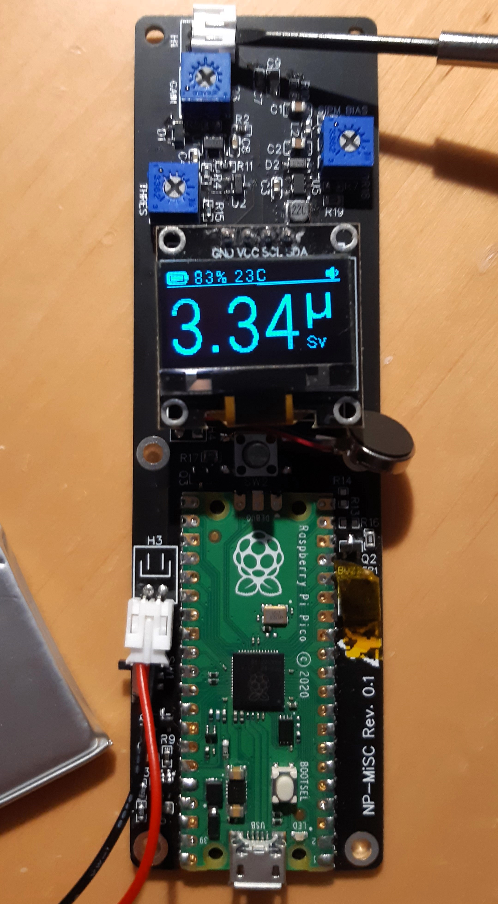
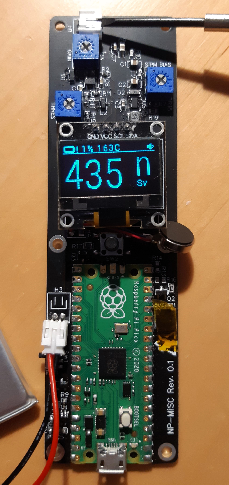

# Enhanced-Geiger

Failed project of mine to build an improved version of the Better Geiger. Some parts were really promising, but I've come to some big hurdles and figured I might as well dump everything on here instead of letting it rot on my PC.

## What worked?

- Much smaller overall size (bare PCB only)
- 1200 mAh rechargable LiPo battery with a MUCH longer battery life (around 100 hours)
- Much larger plastic scintillator!
- Larger OLED display (0.96 inch versus 0.75 inch)
- Otherwise similar features
- Easily possible to add a vibration motor

## What didn't work?

- Getting signal from the plastic scintillator. I could only get
- It would be more expensive of course. At least somewhere double the price, depending on your profit margin obviously. But that wasn't actually a goal, so it's more neutral.
- Mounting the SiPM on the scintillator and that whole assembly onto the PCB so that it doesn't fall apart immediately is also a big problem.

## Misc Photos

Here are two photos of what the first iteration of the board with the display looked like (latest iteration is the second one) just to demonstrate the software.

	
	

---

Have fun with the files. Do whatever you want with it in accordance to the LICENSE.
